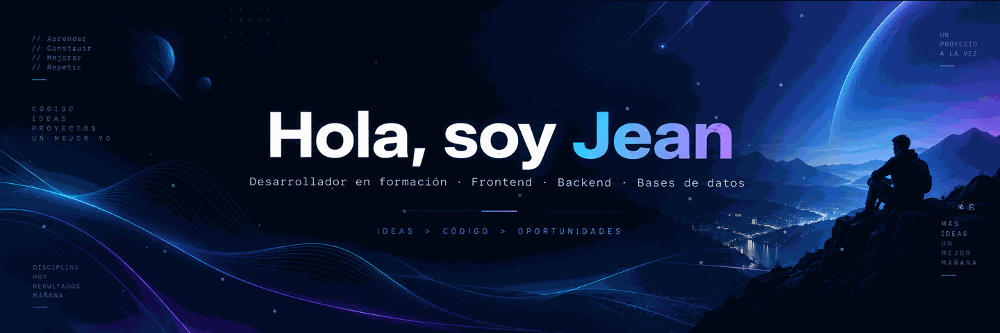

---

---
## 🚀 Sobre mí

Soy una persona enfocada en seguir creciendo como desarrollador mediante **proyectos personales, práctica constante y aprendizaje continuo**.

- 💻 Desarrollo proyectos de **Frontend y Backend**.
- ⚛️ Trabajo y practico con **React, JavaScript y TypeScript**.
- 🔴 Aprendo y desarrollo con **PHP y Laravel**.
- ☕ También utilizo **Java**.
- 🗄️ Trabajo con **SQL, PostgreSQL y HeidiSQL**.
- 🐳 Estoy incorporando **Docker** en mis proyectos.
- 🧩 Me interesa la arquitectura **MVC** y el desarrollo de **APIs REST**.
- 📚 Utilizo GitHub para documentar mi progreso y compartir lo que voy creando.

---

## 🛠️ Tecnologías y herramientas

### 💻 Stack principal

### 🗄️ Bases de datos

---

## ⚡ Lo que estoy fortaleciendo

### 🎨 Frontend

### ⚙️ Backend

### 🗃️ Datos

### 🔧 Herramientas

---

## 📚 Actualmente aprendiendo

- React y TypeScript.
- Laravel y PHP.
- Java.
- PostgreSQL y SQL.
- Docker.
- APIs REST.
- Arquitectura MVC.
- Buenas prácticas de desarrollo.

---

## 📂 En mi GitHub encontrarás

- 🌐 Aplicaciones web.
- ⚛️ Proyectos con React.
- 🔴 Proyectos con Laravel y PHP.
- ☕ Prácticas y proyectos con Java.
- 🗄️ Bases de datos con PostgreSQL y SQL.
- 🐳 Pruebas y entornos con Docker.
- 🔌 APIs REST.
- 🧩 Proyectos organizados con arquitectura MVC.
- 📖 Repositorios de práctica y aprendizaje.

---

## 🐍 Contribuciones en movimiento

---

## 🎯 Objetivos

- 🚀 Seguir mejorando como desarrollador.
- 💻 Crear proyectos personales cada vez más completos.
- ⚛️ Profundizar en React y TypeScript.
- 🔴 Mejorar mis conocimientos de Laravel y PHP.
- ☕ Fortalecer Java.
- 🗄️ Dominar mejor PostgreSQL y SQL.
- 🐳 Integrar Docker con mayor frecuencia.
- 🔌 Crear APIs REST mejor estructuradas.
- 🧩 Aplicar buenas prácticas y arquitectura limpia.
- 📁 Construir un portafolio sólido en GitHub.

---

## ✨ Perfil en evolución

---

## 📫 Contacto

---

